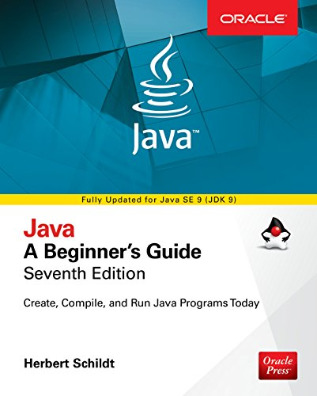

The repository contains solutions and examples for the exercises from the book described below.\
If you want to run the project locally, it can be done easily because it was developed on Docker.

## Java - A Beginner's Guide

#### Seventh Edition

Create, Compile, and Run Java Programs Today\
Herbert Schildt\
Oracle Press



## Technical prerequisites

- Unix-based OS
- Git
- Docker

## Getting started

Run the commands one by one:

```
git clone https://github.com/pavel-rossinsky/java-a-beginners-guide-herbert-schildt.git
cd java-a-beginners-guide-herbert-schildt
mkdir jvm-sources .m2
cp ./docker/builds/jdk/etc/env-example .env
# Open the .env file and set the right path to the project on your OS
# for example /users/you_user_name/Documents/repository/java-a-beginners-guide-herbert-schildt
docker-compose build
```

## How to compile and run a class

Find a class that is of your interest and copy its fully-qualified name, then run:

```
docker-compose run jdk mvn compile exec:java -Dexec.mainClass={fully_qualified_class_name}
```

For instance:

```
docker-compose run jdk mvn compile exec:java -Dexec.mainClass=GalToLitTable
docker-compose run jdk mvn compile exec:java -Dexec.mainClass=SelfTest10
```

or with arguments:

```
docker-compose run jdk mvn compile exec:java -Dexec.mainClass=CLDemo -Dexec.args="one two three"
```

## How to uninstall the project

```
docker-compose down -v
```

## Contents

| # | Chapter | Status |
| --- | --- | --- | 
| 1 | [Java Fundamentals](src/main/java/edu/zjnu/c1) | :ballot_box_with_check: |
| 2 | [Introducing Data Types and Operators](src/main/java/edu/zjnu/c2) | :ballot_box_with_check: |
| 3 | [Program Control Statements](src/main/java/edu/zjnu/c3) | :ballot_box_with_check: |
| 4 | [Introducing Classes, Objects, and Methods](src/main/java/edu/zjnu/c4) | :ballot_box_with_check: |
| 5 | [More Data Types and Operators](src/main/java/edu/zjnu/c5) | :ballot_box_with_check: |
| 6 | [A Closer Look at Methods and Classes](src/main/java/edu/zjnu/c6) | :ballot_box_with_check: |
| 7 | [Inheritance](src/main/java/edu/zjnu/c7) | :ballot_box_with_check: |
| 8 | [Packages and Interfaces](src/main/java/edu/zjnu/c8) | :ballot_box_with_check: |
| 9 | [Exception Handling](src/main/java/edu/zjnu/c9) | :ballot_box_with_check: |
| 10 | [Using I/O](src/main/java/edu/zjnu/c10) | :hourglass_flowing_sand: |
| 11 | [Multithreaded Programming](src/main/java/edu/zjnu/c11) | :coffee: |
| 12 | [Enumerations, Autoboxing, Static Import, and Annotations](src/main/java/edu/zjnu/c12) | :coffee: |
| 13 | [Generics](src/main/java/edu/zjnu/c13) | :coffee: |
| 14 | [Lambda Expressions and Method References](src/main/java/edu/zjnu/c14) | :coffee: |
| 15 | [Modules](src/main/java/edu/zjnu/c15) | :coffee: |
| 16 | [Introducing Swing](src/main/java/edu/zjnu/c16) | :coffee: |
| 17 | [Introducing JavaFX](src/main/java/edu/zjnu/c17) | :coffee: |
| D | [Introducing JShell](src/main/java/edu/zjnu/D) | :coffee: |

