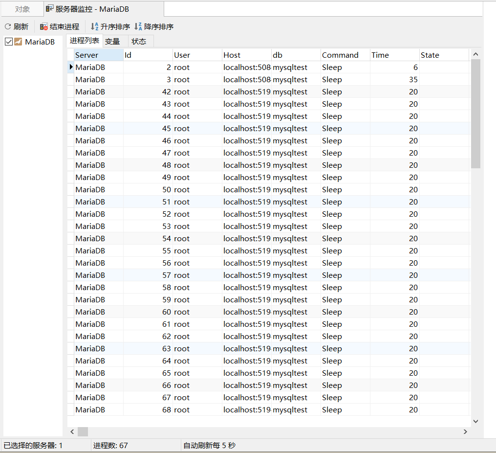

# Node.js操作Mysql数据库模块封装

## 源码

``` javascript
/** 
 * @name：node.js操作mysql数据库模块
 * @author：SunSeekerX
 * @time：2019年6月24日22点26分
 * @dependencies: {
 *   "mysql": "^2.16.0"
 * }
*/

// 引入Mysql模块
const mysql = require('mysql')
// 根据信息创建连接池
const pool = mysql.createPool({
    host: 'localhost',          // 数据库地址
    port: 3306,                 // 数据库端口
    database: 'test',           // 数据库名
    user: 'root',               // 用户名
    password: 'root',           // 数据库密码
    acquireTimeout: 15000,      // 连接超时时间
    connectionLimit: 50,        // 最大连接数
    waitForConnections: true,   // 超过最大连接时排队
    queueLimit: 0,              // 排队最大数量(0 代表不做限制)
})

/** 
 * @description 基本查询
 * @param {Object} sqlObj sql+参数对象
 * @returns {Object} 执行结果
*/
async function query(sqlObj) {
    return new Promise((resolve, reject) => {
        pool.getConnection((err, connection) => { // 从连接池获取连接
            if (err) { return reject(err) } // 获取连接失败，返回错误
            connection.query(sqlObj.sql, sqlObj.params, (error, result) => {
                connection.release() // 释放连接
                error ? reject(error) : resolve(result) // 查询结果
            })
        })
    })
}

/** 
 * @description 开启事物查询
 * @param {Array} sqlArr sql+参数对象集合
 * @returns {Object} 执行结果
*/
async function transaction(sqlArr) {
    return new Promise((resolve, reject) => {
        pool.getConnection((poolError, connection) => { // 从连接池获取连接
            if (poolError) { return reject(poolError) } // 获取连接失败，返回错误
            connection.beginTransaction(async err => { // 开始事务
                if (err) { return reject(err) } // 开始事务失败，返回错误
                let result = [],	// 结果集
                    errInfo = null	//错误对象
                for (let i = 0; i < sqlArr.length; i++) { // 循环查询
                    try {
                        result.push(await new Promise((resolve, reject) => { // 将查询结果放进结果集
                            connection.query(sqlArr[i].sql, sqlArr[i].params, (err, result) => { // 查询
                                err ? reject(err) : resolve(result)
                            })
                        }))
                    } catch (e) { // sql语句执行出错，跳出循环，不继续执行
                        errInfo = e
                        break
                    }
                }
                pool.releaseConnection(connection) // 释放链接
                if (errInfo) {
                    connection.rollback(() => { // 有数据条目执行失败, 回滚代码
                        reject(errInfo)
                    })
                } else {
                    connection.commit(err => { // 语句全部执行成功，commit提交
                        err ? reject(err) : resolve(result)
                    })
                }
            })
        })
    })
}

module.exports = { query, transaction }

```

## 使用以及注意事项

- 本工具模块封装于本人初尝node与es7，代码潦草，以及不合理之处请指出，本人心里感激不尽。
- 感谢妖火论坛一位老哥的帮忙，真心感谢
- 数据表引擎类型一定为支持事务类型（`InnoDB`）
- 支持es7 await
- 本次测试环境

|      名称       |       值        |           说明            |
| :-------------: | :-------------: | :-----------------------: |
|   数据库版本    | 10.1.37-MariaDB |     SELECT version();     |
|   node.js版本   |    v10.15.1     |          node -v          |
| mysql官方包版本 |    "^2.16.0"    | package.json>dependencies |
|     数据库      |    mysqltest    |                           |
|       表        |      user       |                           |

- 数据库结构语句

``` sql
/*
 Navicat Premium Data Transfer

 Source Server         : MariaDB
 Source Server Type    : MariaDB
 Source Server Version : 100137
 Source Host           : localhost:3306
 Source Schema         : mysqltest

 Target Server Type    : MariaDB
 Target Server Version : 100137
 File Encoding         : 65001

 Date: 19/03/2019 22:52:05
*/

SET NAMES utf8mb4;
SET FOREIGN_KEY_CHECKS = 0;

-- ----------------------------
-- Table structure for user
-- ----------------------------
DROP TABLE IF EXISTS `user`;
CREATE TABLE `user`  (
  `id` int(11) NOT NULL AUTO_INCREMENT,
  `name` varchar(255) CHARACTER SET utf8 COLLATE utf8_general_ci NULL DEFAULT NULL,
  `age` varchar(255) CHARACTER SET utf8 COLLATE utf8_general_ci NOT NULL,
  PRIMARY KEY (`id`) USING BTREE
) ENGINE = InnoDB AUTO_INCREMENT = 180001 CHARACTER SET = utf8 COLLATE = utf8_general_ci ROW_FORMAT = Compact;

SET FOREIGN_KEY_CHECKS = 1;

```

#### 单条语句测试

- 事务测试



- 测试代码

``` javascript
const mysql = require('../utils/mysqlpool')
const sqlArr = [
    {sql: 'INSERT INTO `user` (name,age) VALUES (?,?)', params: ['libai', 1]},
    {sql: 'INSERT INTO `user` (name,age) VALUES (?,?)', params: ['hanxin', 2]},
    {sql: 'INSERT INTO `user` (name,age) VALUES (?,?)', params: ['libai', 3]},
]
for(let i = 0; i < 30000; i++){
    mysql.transaction(sqlArr)
        .then(res =>{
            console.log(`第${i}次执行成功`)
        } ,err =>{
            console.log('插入失败')
        })
}
```

- 使用了连接池不会造成数据库连接爆炸，测试使用了3000次查询，每次3条语句，共9W条，用时`21.4s`
- 没有出现插入失败或者错误情况出现

#### 单条语句测试

- 测试代码

``` javascript
const mysql = require('../utils/mysqlpool')
const sqlObj = {sql: 'INSERT INTO `user` (name,age) VALUES (?,?)', params: ['libai', 1]}
for(let i = 0; i < 90000; i++){
    mysql.query(sqlObj)
    .then(res =>{
        console.log(`第${i}次执行成功`)
    } ,err =>{
        console.log('插入失败')
    })
}
```

- 插入同样的9W条数据用时`39秒`左右

#### 总结

- 不论是单条语句还是事务支持事务的多条语句，执行完发现连接线程一直处于sleep状态，网上查找资料需要需要mysql配置，由于本次只使用了64个连接，如数据库对于其他的项目还有连接，可减少连接数，一般不会造成连接瓶颈
- 对于node.js操作个人认为封装的够用，用来码接口很方便，这里放一个自己项目中一个接口的实例

``` javascript
    // Get classList
    static async getClassList(req, res){
        jwt.checkToken(req.headers.token, 'webapp_user', async checkTokenRes => {
            if (checkTokenRes){
                const sqlObj = {sql: 'SELECT * FROM `webapp_class` LIMIT 0,1000'}
                try {
                    const data = await mysql.query(sqlObj)
                    res.json({ code: code.success, message: code.successMsg, data }) // Request success
                }catch (e) {
                    res.json({code: code.execSqlFail, message: code.execSqlFailMsg, err: e.message}) // ExecSql fail
                }

            }else{
                res.json({ code: code.noToken, message: code.noTokenMsg }) // Check token fail
            }
        })
    }
```


