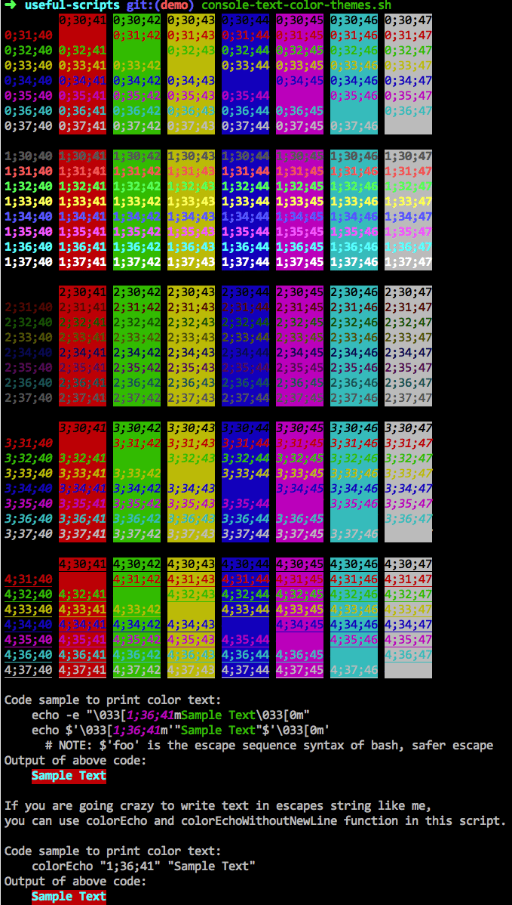

🐌 `Shell`相关脚本
====================================

<!-- START doctoc generated TOC please keep comment here to allow auto update -->
<!-- DON'T EDIT THIS SECTION, INSTEAD RE-RUN doctoc TO UPDATE -->

- [`Shell`使用加强](#shell%E4%BD%BF%E7%94%A8%E5%8A%A0%E5%BC%BA)
    - [🍺 c](#-c)
        - [用法/示例](#%E7%94%A8%E6%B3%95%E7%A4%BA%E4%BE%8B)
        - [参考资料](#%E5%8F%82%E8%80%83%E8%B5%84%E6%96%99)
    - [🍺 coat and taoc](#-coat-and-taoc)
        - [用法/示例](#%E7%94%A8%E6%B3%95%E7%A4%BA%E4%BE%8B-1)
    - [🍺 a2l](#-a2l)
        - [用法/示例](#%E7%94%A8%E6%B3%95%E7%A4%BA%E4%BE%8B-2)
    - [🍺 uq](#-uq)
        - [用法/示例](#%E7%94%A8%E6%B3%95%E7%A4%BA%E4%BE%8B-3)
    - [🍺 ap and rp](#-ap-and-rp)
        - [用法/示例](#%E7%94%A8%E6%B3%95%E7%A4%BA%E4%BE%8B-4)
    - [🍺 cp-into-docker-run](#-cp-into-docker-run)
        - [用法/示例](#%E7%94%A8%E6%B3%95%E7%A4%BA%E4%BE%8B-5)
    - [🍺 tcp-connection-state-counter](#-tcp-connection-state-counter)
        - [用法/示例](#%E7%94%A8%E6%B3%95%E7%A4%BA%E4%BE%8B-6)
        - [贡献者](#%E8%B4%A1%E7%8C%AE%E8%80%85)
    - [🍺 xpl and xpf](#-xpl-and-xpf)
        - [用法/示例](#%E7%94%A8%E6%B3%95%E7%A4%BA%E4%BE%8B-7)
        - [贡献者](#%E8%B4%A1%E7%8C%AE%E8%80%85-1)
- [`Shell`开发/测试加强](#shell%E5%BC%80%E5%8F%91%E6%B5%8B%E8%AF%95%E5%8A%A0%E5%BC%BA)
    - [🍺 echo-args](#-echo-args)
        - [用法/示例](#%E7%94%A8%E6%B3%95%E7%A4%BA%E4%BE%8B-8)
        - [使用方式](#%E4%BD%BF%E7%94%A8%E6%96%B9%E5%BC%8F)
    - [🍺 console-text-color-themes.sh](#-console-text-color-themessh)
        - [用法](#%E7%94%A8%E6%B3%95)
        - [示例](#%E7%A4%BA%E4%BE%8B)
        - [运行效果](#%E8%BF%90%E8%A1%8C%E6%95%88%E6%9E%9C)
        - [贡献者](#%E8%B4%A1%E7%8C%AE%E8%80%85-2)
        - [参考资料](#%E5%8F%82%E8%80%83%E8%B5%84%E6%96%99-1)
    - [🍺 parseOpts.sh](#-parseoptssh)
        - [用法](#%E7%94%A8%E6%B3%95-1)
        - [示例](#%E7%A4%BA%E4%BE%8B-1)
        - [兼容性](#%E5%85%BC%E5%AE%B9%E6%80%A7)
        - [贡献者](#%E8%B4%A1%E7%8C%AE%E8%80%85-3)

<!-- END doctoc generated TOC please keep comment here to allow auto update -->

`Shell`使用加强
====================================

🍺 [c](../bin/c)
----------------------

原样命令行输出，并拷贝标准输出到系统剪贴板，省去`CTRL+C`操作，优化命令行与其它应用之间的操作流。  
支持`Linux`、`Mac`、`Windows`（`cygwin`、`MSSYS`）。

命令名`c`的意思是`Copy`，因为这个命令我平时非常常用，所以使用一个字符的命令名，方便快速键入。

更多说明参见[拷贝复制命令行输出放在系统剪贴板上](http://oldratlee.github.io/post/2012-12-23/command-output-to-clip)。

### 用法/示例

有3种使用风格，根据需要或是你的偏好选取。

```bash
############################################################
# 1. 前缀方式，后面跟上要运行的命令
############################################################
$ c pwd
/Users/jerry
$ c echo -e 'a\nb'
a
b
# 这种使用方式，后面跟的命令不能是别名（alias），对于别名可以用下面的使用方式。

############################################################
# 2. 后缀方式，管道
############################################################
$ echo -e 'a\nb' | nl | c
1   a
2   b
# gb是oh-my-zsh的别名，列出git的分支，需要后缀的方式的使用。
$ gb | c

############################################################
# 3. 从标准输入读取内容。拷贝文件内容时这种方式最直接。
############################################################
$ c < ~/.ssh/id_rsa.pub
ssh-rsa EAAAABIwAAAQEAz+ETZEgoLeIiC0rjWewdDs0sbo8c...== a@b.com

############################################################
# -q选项：拷贝但不输出。
# 当输出内容比较多、又不关心输出内容和命令执行进展时，可以使用这个选项。
############################################################
$ c -q < ~/.ssh/id_rsa.pub

# 帮助信息
$ c --help
Usage: c [OPTION]... [command [command_args ...]]
Run command and put output to system clipper.
If no command is specified, read from stdin(pipe).

Example:
  c grep -i 'hello world' menu.h main.c
  set | c
  c -q < ~/.ssh/id_rsa.pub

Options:
  -k, --keep-eol  do not trim new line at end of file
  -q, --quiet     suppress all normal output, default is false
  -h, --help      display this help and exit
  -V, --version   display version information and exit
```

### 参考资料

- [拷贝复制命令行输出放在系统剪贴板上](http://oldratlee.github.io/post/2012-12-23/command-output-to-clip)，给出了不同系统可用命令。
- 关于文本文件最后的换行，参见[Why should text files end with a newline?](https://stackoverflow.com/questions/729692)

<a id="-coat"></a>

🍺 [coat](../bin/coat) and [taoc](../bin/taoc)
----------------------

彩色`cat`/`tac`出文件行，方便人眼区分不同的行。  
支持`Linux`、`Mac`、`Windows`（`cygwin`、`MSSYS`）。

命令支持选项、功能和使用方式与[`cat`](https://manned.org/cat)/[`tac`](https://manned.org/tac)命令完全一样。  
文件操作在实现上完全代理给了`cat`/`tac`命令。

- 命令名`coat`的意思是`COlorful cAT`；同时单词`coat`是外套，而彩色的输出行就像件漂亮的外套～ 🌈 😆
- 命令名`taoc`是`coat`倒序拼写；命名方式就像`tac`之于`cat`。 🐈

### 用法/示例

```bash
$ echo Hello world | coat
Hello world
$ echo -e 'Hello\nWorld' | coat
Hello
World
$ echo -e 'Hello\nWorld' | taoc
World
Hello
$ echo -e 'Hello\nWorld' | nl | coat
     1	Hello
     2	World
$ coat file1 file2.txt
line1 of file1
line2 of file1
...
line1 of file2
line2 of file2
...

# 帮助信息
#   可以看到本人机器上实现代理的`cat`/`tac`命令是GNU的实现。
$ coat --help
Usage: coat [OPTION]... [FILE]...
cat lines colorfully.

Support options:
  --help     display this help and exit
  --version  output version information and exit
All other options and arguments are delegated to command cat,
more info see the help/man of command cat(e.g. cat --help).
cat executable: /usr/local/opt/coreutils/libexec/gnubin/cat

$ taoc --help
Usage: taoc [OPTION]... [FILE]...
tac lines colorfully.

Support options:
  --help     display this help and exit
  --version  output version information and exit
All other options and arguments are delegated to command tac,
more info see the help/man of command tac(e.g. tac --help).
tac executable: /usr/local/opt/coreutils/libexec/gnubin/tac
```

注：上面示例中，没有彩色；在控制台上运行可以看出彩色效果，如下：  


🍺 [a2l](../bin/a2l)
----------------------

按行彩色输出参数，方便人眼查看。  
支持`Linux`、`Mac`、`Windows`（`cygwin`、`MSSYS`）。

命令名`a2l`的意思是`Arguments to(2) Lines`。

### 用法/示例

```bash
$ a2l *.java
A.java
B.java
...

# zsh支持 **/* 跨目录glob，可以方便搜索，但是输出内容是空格分隔的不方便查看。
# 把参数按行输出方便查看 或是 grep
$ a2l **/*.sh
lib/console-text-color-themes.sh
test/parseOpts_test.sh
test/self-installer.sh
...
```

注：上面示例中，没有彩色；在控制台上运行可以看出彩色效果，和上面的`coat`命令一样。

🍺 [uq](../bin/uq)
----------------------

不重排序输入完成整个输入行的去重。相比系统的`uniq`命令加强的是可以跨行去重，不需要排序输入。  
使用方式与支持的选项 模仿系统的`uniq`命令。支持`Linux`、`Mac`、`Windows`（`cygwin`、`MSSYS`）。

> ‼️ **_注意_**： 去重过程会在内存持有整个输入（因为全局去重）！
>
> 对于输入大小较大的场景（如输入量有几G），需谨慎使用以避免占用过多内存；往往需要结合业务场景开发对应的优化实现。  
> 虽然平时的大部分场景输入量非常有限（如几M），一个简单没有充分优化的实现是快速够用的。
>
> `uq`处理的最大输入量缺省是 256m（字符数），超过了最大输入量则出错退出，以避免意外消耗了过大的内存；  
> 可以通过`-XM, --max-input`选项 设置 消耗更多内存可接受的合理最大输入量，如`uq --max-input 1g ...`

因为系统的`uniq`命令去重相邻的行，需要组合`sort`命令以对整个输入去重，并且有下面的问题：

```bash
# 示例输入
$ cat foo.txt
c
c
b
a
a
c
c

$ uniq foo.txt
c
b
a
c
# c输出了2次，原因是第二个c与第一个c不是相邻的重复行

# 可以通过 sort -u 来完成整个输入去重，但这样操作，顺序与输入行不一致
$ sort -u foo.txt
a
b
c
# 输入行重排序了！

# 另外一个经典的用法 sort 与 uniq -c，输出重复次数
$ sort foo.txt | uniq -c
      2 a
      1 b
      4 c
# 输入行重排序了！
```

### 用法/示例

```bash
$ uq foo.txt # 输入是文件
$ cat foo.txt | uq # 或是 标准输入/管道
c
b
a
# 对整个输入行去重，且顺序与输入行一致（保留第一次出现的位置）

# -c 选项：输出重复次数
$ uq -c foo.txt
      4 c
      1 b
      2 a

# -d, --repeated 选项：只输出 重复行
$ uq -d foo.txt
c
a
# -u, --unique 选项：只输出 唯一行（即不重复的行）
$ uq -u foo.txt
b

# -D 选项：重复行都输出，即重复了几次就输出几次
$ uq -D -c foo.txt
      4 c
      4 c
      1 b
      2 a
      2 a
      4 c
      4 c

# 有多个文件参数时，最后一个参数 是 输出文件
$ uq in1.txt in2.txt out.txt
# 当有多个输入文件时，但要输出到控制台时，指定输出文件（最后一个文件参数）为 `-` 即可
$ uq in1.txt in2.txt -

# 如果消耗更多内存可接受的合理的，可以通过 -XM, --max-input 选项设置更大的最大输入量（缺省是256m）
$ uq -MI 768m large-file-input
$ uq --max-input 10g huge-file-input

# 帮助信息
$ uq -h
Usage: uq [OPTION]... [INPUT [OUTPUT]]
Filter lines from INPUT (or standard input), writing to OUTPUT (or standard output).
Same as `uniq` command in core utils,
but detect repeated lines that are not adjacent, no sorting required.

Example:
  # only one file, output to stdout
  uq in.txt
  # more than 1 file, last file argument is output file
  uq in.txt out.txt
  # when use - as output file, output to stdout
  uq in1.txt in2.txt -

Options:
  -c, --count           prefix lines by the number of occurrences
  -d, --repeated        only print duplicate lines, one for each group
  -D                    print all duplicate lines
                        combined with -c/-d option usually
  --all-repeated[=METHOD]  like -D, but allow separating groups
                           with an empty line;
                           METHOD={none(default),prepend,separate}
  -u, --unique          Only output unique lines
                          that are not repeated in the input
  -i, --ignore-case     ignore differences in case when comparing
  -z, --zero-terminated line delimiter is NUL, not newline
  -XM, --max-input      max input size(count by char), support k,m,g postfix
                          default is 256m
                          avoid consuming large memory unexpectedly
  -h, --help            display this help and exit
  -V, --version         display version information and exit
```

🍺 [ap](../bin/ap) and [rp](../bin/rp)
----------------------

批量转换文件路径为绝对路径/相对路径，会自动跟踪链接并规范化路径。  
支持`Linux`、`Mac`、`Windows`（`cygwin`、`MSSYS`）。

命令名`ap`的意思是`Absolute Path`，`rp`是`Relative Path`。

### 用法/示例

```bash
# ap缺省打印当前路径的绝对路径
$ ap
/home/admin/useful-scripts/test
$ ap ..
/home/admin/useful-scripts
# 支持多个参数
$ ap .. ../.. /etc /etc/../etc
/home/admin/useful-scripts
/home/admin
/etc
/etc

# rp当一个参数时，打印相对于当前路径的相对路径
$ rp /home
../..
# 多于一个参数时，打印相对于最后一个参数的相对路径
$ rp /home /etc/../etc /home/admin
..
../../etc
```

🍺 [cp-into-docker-run](../bin/cp-into-docker-run)
----------------------

一个`Docker`使用的便利脚本。拷贝本机的执行文件到指定的`docker container`中并在`docker container`中执行。   
支持`Linux`、`Mac`、`Windows`（`cygwin`、`MSSYS`）。

### 用法/示例

```bash
# 通过 -c 选项 指定 docker container
$ cp-into-docker-run -c container_foo /path/to/command command_args...
# 如果 指定的command 不是一个路径，会从 PATH 中查找
$ cp-into-docker-run -c container_foo a2l command_arg1 command_arg2

# 帮助信息
$ cp-into-docker-run -h
Usage: cp-into-docker-run [OPTION]... command [command-args]...

Copy the command into docker container
and run the command in container.

Example:
  cp-into-docker-run -c container_foo command_copied_into_container command_arg1

docker options:
  -c, --container    destination docker container
  -u, --docker-user  docker username or UID to run command
                     optional, docker default is (maybe) root user
  -w, --workdir      absolute working directory inside the container
                     optional, docker default is (maybe) root dir
  -t, --tmpdir       tmp dir in docker to copy command
                     optional, default is /tmp
  -p, --cp-path      destination path in docker of the command(including file name)
                     if specified, command will be kept when run finished
                     optional, default is under tmp dir and deleted when run finished

run options:
  -v, --verbose      show operation step infos

miscellaneous:
  -h, --help         display this help and exit
  -V, --version      display version information and exit
```

<a id="beer-tcp-connection-state-countersh"></a>
<a id="beer-tcp-connection-state-counter"></a>

🍺 [tcp-connection-state-counter](../bin/tcp-connection-state-counter)
----------------------

统计各个`TCP`连接状态的个数。  
支持`Linux`、`Mac`、`Windows`（`cygwin`、`MSSYS`）。

像`Nginx`、`Apache`的机器上需要查看，`TCP`连接的个数，以判定

- 连接数、负荷
- 是否有攻击，查看`SYN_RECV`数（`SYN`攻击）
- `TIME_WAIT`数，太多会导致`TCP: time wait bucket table overflow`。

### 用法/示例

```bash
$ tcp-connection-state-counter
CLOSE_WAIT  584
ESTABLISHED 493
TIME_WAIT   112
LISTEN       27
SYN_SENT      7
```

### 贡献者

[sunuslee](https://github.com/sunuslee) 改进此脚本，增加对`MacOS`的支持。 [#56](https://github.com/oldratlee/useful-scripts/pull/56)

🍺 [xpl](../bin/xpl) and [xpf](../bin/xpf)
----------------------

在命令行中快速完成 在文件浏览器中 打开/选中 指定的文件或文件夹的操作，优化命令行与其它应用之间的操作流。  
支持`Linux`、`Mac`、`Windows`（`cygwin`、`MSSYS`）。

- `xpl`：在文件浏览器中打开指定的文件或文件夹。  
  `xpl`是`explorer`的缩写。
- `xpf`: 在文件浏览器中打开指定的文件或文件夹，并选中。  
  `xpf`是`EXplorer and select File`的缩写。

### 用法/示例

```bash
xpl
# 缺省打开当前目录
xpl <文件或是目录>...
# 打开多个文件或目录

xpf
# 缺省打开当前目录
xpf <文件或是目录>...
# 打开多个文件或目录


# 示例
xpl /path/to/dir
xpl /path/to/foo.txt
xpl /path/to/dir1 /path/to/foo1.txt
xpf /path/to/foo1.txt
xpf /path/to/dir1 /path/to/foo1.txt
```

### 贡献者

- [Linhua Tan](https://github.com/toolchainX) 修复Linux的选定Bug。

`Shell`开发/测试加强
====================================

<a id="beer-echo-argssh"></a>
<a id="beer-echo-args"></a>

🍺 [echo-args](../bin/echo-args)
----------------------

在编写脚本时，常常要确认输入参数是否是期望的：参数个数，参数值（可能包含有人眼不容易发现的空格问题）。  
支持`Linux`、`Mac`、`Windows`（`cygwin`、`MSSYS`）。

这个脚本输出脚本收到的参数。在控制台运行时，把参数值括起的括号显示成 **红色**，方便人眼查看。

### 用法/示例

```bash
$ ./echo-args 1 "  2 foo  " "3        3"
0/3: [./echo-args]
1/3: [1]
2/3: [  2 foo  ]
3/3: [3        3]
```

### 使用方式

需要查看某个脚本（实际上也可以是其它的可执行程序）输出参数时，可以这么做：

- 把要查看脚本重命名。
- 建一个`echo-args`脚本的符号链接到要查看参数的脚本的位置，名字和查看脚本一样。

这样可以不改其它的程序，查看到输入参数的信息。

🍺 [console-text-color-themes.sh](../lib/console-text-color-themes.sh)
----------------------

显示`Terminator`的全部文字彩色组合的效果及其打印方式。  
支持`Linux`、`Mac`、`Windows`（`cygwin`、`MSSYS`）。

脚本中，也给出了`colorEcho`和`colorEchoWithoutNewLine`函数更方便输出彩色文本

### 用法

```bash
colorEcho <颜色样式> <要输出的文本>...
colorEchoWithoutNewLine  <颜色样式> <要输出的文本>...
```

### 示例

```bash
source console-text-color-themes.sh

# 输出红色文本
colorEcho "0;31;40" "Hello world!"
# 输出黄色带下划线的文本
colorEchoWithoutNewLine "4;33;40" "Hello world!" "Hello Hell!"
```

### 运行效果



### 贡献者

[姜太公](https://github.com/jzwlqx) 提供循环输出彩色组合的脚本。

### 参考资料

- [utensil](https://github.com/utensil)
  的[在Bash下输出彩色的文本](http://utensil.github.io/tech/2007/09/10/colorful-bash.html)，这是篇很有信息量很钻研的文章！

🍺 [parseOpts.sh](../lib/parseOpts.sh)
----------------------

命令行选项解析库，加强支持选项有多个值（即数组）。  
支持`Linux`、`Mac`、`Windows`（`cygwin`、`MSSYS`）。

自己写一个命令行选项解析函数，是因为[`bash`](https://manned.org/bash)的`builtin`命令[`getopts`](https://manned.org/man/getopts.1)和加强版本命令[`getopt`](https://manned.org/getopt)都不支持数组的值。

指定选项的多个值（即数组）的风格模仿[`find`](https://manned.org/find)命令的`-exec`选项：

```bash
$ find . -name \*.txt -exec echo "find file: " {} \;
find file: foo.txt
find file: bar.txt
...
```

### 用法

`parseOpts`函数的第一个参数是要解析的选项说明，后面跟实际要解析的输入参数。

选项说明可以长选项和短选项，用逗号分隔，如`a,a-long`。不同选项的说明间用竖号分隔，如`a,a-long|b,b-long:`。

选项说明最后可以有选项类型说明：

- `-`： 无参数的选项。既有选项则把值设置成`true`。这是 ***缺省*** 的类型。
- `:`： 有参数的选项，值只有一个。
- `+`： 有多个参数值的选项。值列表要以`;`表示结束。  
  注意，`;`是`Bash`的元字符（用于一行中多个命令分隔），所以加上转义写成`\;`（当然也可以按你的喜好写成`";"`或`';'`）。

实际要解析的输入参数往往是你的脚本参数，这样`parseOpts`函数调用一般是：

```bash
parseOpts "a,a-long|b,b-long:|c,c-long+" "$@"
# "$@" 即是回放你的脚本参数
```

通过约定的全局变量来获取选项和参数：

- 选项名为`a`，通过全局变量`_OPT_VALUE_a`来获取选项的值。
- 选项名为`a-long`，通过全局变量`_OPT_VALUE_a_long`来获取选项的值。  
  即，把选项名的`-`转`_`，再加上前缀`_OPT_VALUE_`对应的全局变量来获得选项值。
- 除了选项剩下的参数，通过全局变量`_OPT_ARGS`来获取。

按照惯例，输入参数中如果有`--`表示之后参数中不再有选项，即之后都是参数。

### 示例

```bash
# 导入parseOpts.sh
source /path/to/parseOpts.sh

parseOpts "a,a-long|b,b-long:|c,c-long+" -a -b bv --c-long c.sh -p pv -q qv arg1 \; aa bb cc
# 可以通过下面全局变量来获得解析的参数值：
#    _OPT_VALUE_a = true
#    _OPT_VALUE_a_long = true
#    _OPT_VALUE_b = bv
#    _OPT_VALUE_b_long = bv
#    _OPT_VALUE_c = (c.sh -p pv -q qv arg1) ，数组类型
#    _OPT_VALUE_c_long = (c.sh -p pv -q qv arg1) ，数组类型
#    _OPT_ARGS = (aa bb cc) ，数组类型
```

`--`的使用效果示例：

```bash
# 导入parseOpts.sh
source /path/to/parseOpts.sh

parseOpts "a,a-long|b,b-long:|c,c-long+" -a -b bv -- --c-long c.sh -p pv -q qv arg1 \; aa bb cc
# 可以通过下面全局变量来获得解析的参数值：
#    _OPT_VALUE_a = true
#    _OPT_VALUE_a_long = true
#    _OPT_VALUE_b = bv
#    _OPT_VALUE_b_long = bv
#    _OPT_VALUE_c 没有设置过
#    _OPT_VALUE_c_long 没有设置过
#    _OPT_ARGS = (--c-long c.sh -p pv -q qv arg1 ';' aa bb cc) ，数组类型
```

### 兼容性

这个脚本比较复杂，测试过的环境有：

1. `bash --version`  
   `GNU bash, version 4.1.5(1)-release (x86_64-pc-linux-gnu)`  
   `uname -a`  
   `Linux foo-host 2.6.32-41-generic #94-Ubuntu SMP Fri Jul 6 18:00:34 UTC 2012 x86_64 GNU/Linux`
1. `bash --version`  
   `GNU bash, version 3.2.53(1)-release (x86_64-apple-darwin14)`  
   `uname -a`  
   `Darwin foo-host 14.0.0 Darwin Kernel Version 14.0.0: Fri Sep 19 00:26:44 PDT 2014; root:xnu-2782.1.97~2/RELEASE_X86_64 x86_64 i386 MacBookPro10,1 Darwin`
1. `bash --version`  
   `GNU bash, version 3.00.15(1)-release (i386-redhat-linux-gnu)`  
   `uname -a`  
   `Linux foo-host 2.6.9-103.ELxenU #1 SMP Wed Mar 14 16:31:15 CST 2012 i686 i686 i386 GNU/Linux`

### 贡献者

- [Khotyn Huang](https://github.com/khotyn) 指出`bash` `3.0`下使用有问题，并提供`bash` `3.0`的测试机器。

