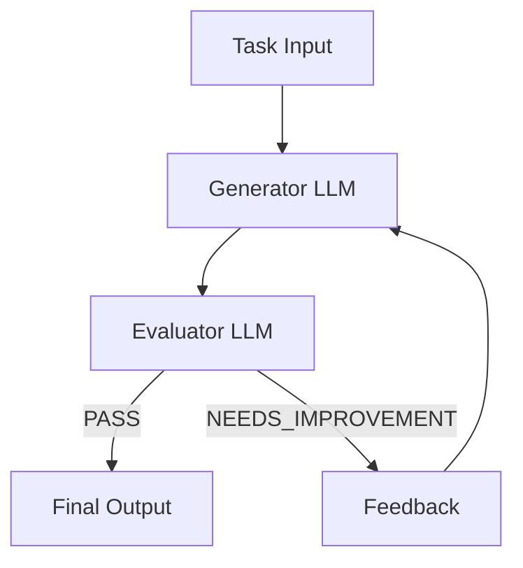

# Evaluator-Optimizer Pattern

This project demonstrates the Evaluator-Optimizer pattern for building effective LLM-based systems, as described in [Anthropic's research on building effective agents](https://www.anthropic.com/research/building-effective-agents).


## Overview

The Evaluator-Optimizer pattern implements a dual-LLM process where one model generates responses while another provides evaluation and feedback in an iterative loop, similar to a human writer's iterative refinement process. The pattern consists of two main components:

- **Generator LLM**: Produces initial responses and refines them based on feedback
- **Evaluator LLM**: Analyzes responses and provides detailed feedback for improvement

## How It Works

1. The generator LLM produces an initial solution for the given task
2. The evaluator LLM assesses the solution against quality criteria
3. If the solution passes evaluation, it's returned as the final result
4. If improvements are needed, feedback is incorporated into a new generation cycle
5. The process repeats until a satisfactory solution is achieved



## When to Use

This pattern is particularly effective when:

- Clear evaluation criteria exist for assessing response quality
- Iterative refinement provides measurable value to the output
- Tasks benefit from multiple rounds of critique and improvement

### Example Applications

- Literary translation requiring capture of subtle nuances
- Complex search tasks needing multiple rounds of searching and analysis
- Code generation where quality can be improved through systematic review
- Content creation requiring multiple drafts and specific improvements

## Implementation

The implementation uses Spring AI's ChatClient for LLM interactions and consists of:

```java
public class EvaluatorOptimizer {
    public RefinedResponse loop(String task) {
        // 1. Generate initial solution
        Generation generation = generate(task, context);
        
        // 2. Evaluate the solution
        EvaluationResponse evaluation = evaluate(generation.response(), task);
        
        // 3. If PASS, return solution
        // 4. If NEEDS_IMPROVEMENT, incorporate feedback and generate new solution
        // 5. Repeat until satisfactory
        return new RefinedResponse(finalSolution, chainOfThought);
    }
}
```

### Usage Example

```java
ChatClient chatClient = // ... initialize chat client
EvaluatorOptimizer agent = new EvaluatorOptimizer(chatClient);

// Process a task
RefinedResponse response = agent.loop(
    "Create a Java class implementing a thread-safe counter"
);

// Access results
System.out.println("Final Solution: " + response.solution());
System.out.println("Evolution: " + response.chainOfThought());
```

## Customization

The pattern can be customized through:

1. **Custom Prompts**: Provide specialized prompts for generator and evaluator
```java
agent = new EvaluatorOptimizer(
    chatClient,
    customGeneratorPrompt,
    customEvaluatorPrompt
);
```

2. **Default Templates**: Modify the default prompts for common use cases
   - `DEFAULT_GENERATOR_PROMPT`: Template for solution generation
   - `DEFAULT_EVALUATOR_PROMPT`: Template for solution evaluation

## Response Formats

### Generation Response
```json
{
    "thoughts": "Brief description of approach",
    "response": "Actual solution content"
}
```

### Evaluation Response
```json
{
    "evaluation": "PASS|NEEDS_IMPROVEMENT|FAIL",
    "feedback": "Detailed feedback for improvement"
}
```

## Dependencies

- Spring AI
- Spring Boot
- Java 17 or later

## References

- [Building Effective Agents (Anthropic Research)](https://www.anthropic.com/research/building-effective-agents)
