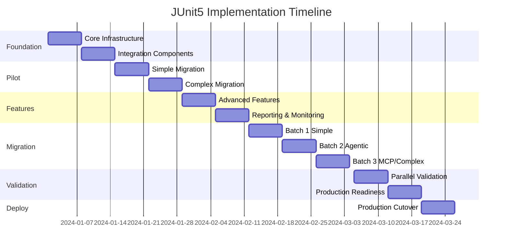

# JUnit5 Implementation Roadmap

## Executive Summary

This roadmap outlines the implementation plan for transforming the Spring AI Examples integration testing framework from JBang-based scripts to a modern JUnit5 annotation-driven system with AI validation. The implementation spans 12 weeks with clear milestones, deliverables, and success criteria.

## Vision and Goals

### Vision Statement
Create a world-class integration testing framework that leverages AI to validate complex, non-deterministic outputs while providing developers with familiar JUnit5 tooling and excellent IDE support.

### Strategic Goals
1. **Developer Experience**: Reduce test debugging time by 40% through IDE integration
2. **Reliability**: Achieve 99% test reliability with intelligent validation
3. **Performance**: Maintain or improve current test execution times
4. **Cost Efficiency**: Optimize AI validation costs through caching and batching
5. **Maintainability**: Reduce test maintenance effort by 50%

## Implementation Phases

### Phase 0: Planning and Setup (Week 0 - Pre-Implementation)
**Status**: ✅ Complete

#### Completed Deliverables
- ✅ Architecture design document
- ✅ Migration strategy document
- ✅ AI validator integration design
- ✅ API design specifications
- ✅ Implementation roadmap (this document)

### Phase 1: Foundation Development (Weeks 1-2)

#### Week 1: Core Infrastructure
**Objective**: Establish base JUnit5 extension framework

**Tasks**:
- [ ] Create Maven module: `spring-ai-test-framework`
- [ ] Implement core annotations
  - [ ] `@SpringAIIntegrationTest`
  - [ ] `@AIValidation`
  - [ ] `@ExpectedBehavior` with README inference support
  - [ ] `@SuccessPatterns`
  - [ ] `@ContextResources` for multi-source context
- [ ] Develop `SpringAITestExtension` skeleton
- [ ] Set up project structure and dependencies

**Deliverables**:
- Compilable framework module
- Basic annotation processors
- Unit tests for annotations

**Success Criteria**:
- Framework compiles without errors
- Annotations can be applied to test classes
- Extension loads in JUnit5 runtime

#### Week 2: Integration Components
**Objective**: Build validation engine integration

**Tasks**:
- [ ] Implement `AIValidationController`
- [ ] Create `ProcessBasedValidatorExecutor`
- [ ] Develop `ValidationRequestBuilder` with README inference
- [ ] Build `ValidationResponseParser`
- [ ] Create `ContextInferenceEngine` for README parsing
- [ ] Implement `ReadmeParser` for markdown processing
- [ ] Create compatibility bridge for `IntegrationTestUtils`

**Deliverables**:
- Working validation pipeline
- JSON-to-annotation converter tool
- Integration test for validation flow

**Success Criteria**:
- Can execute Python validator from Java
- Successful round-trip validation test
- Converter generates valid Java code

### Phase 2: Pilot Implementation (Weeks 3-4)

#### Week 3: Simple Example Migration
**Objective**: Migrate and validate simple example

**Target Module**: `kotlin/kotlin-hello-world`

**Tasks**:
- [ ] Convert `ExampleInfo.json` to annotations
- [ ] Create `KotlinHelloWorldIntegrationTest.java`
- [ ] Implement output capture mechanism
- [ ] Add regex pattern validation
- [ ] Integrate AI validation

**Deliverables**:
- First working JUnit5 integration test
- Side-by-side comparison report
- Performance benchmarks

**Success Criteria**:
- Test passes with JUnit5
- Results match JBang execution
- Performance within 10% of original

#### Week 4: Complex Example Migration
**Objective**: Validate complex workflow handling

**Target Modules**:
1. `agentic-patterns/chain-workflow` (complex workflow)
2. `model-context-protocol/sqlite/simple` (MCP protocol)

**Tasks**:
- [ ] Migrate chain-workflow example
- [ ] Implement setup/teardown command support
- [ ] Migrate MCP example
- [ ] Add component validation support
- [ ] Create comparison test suite

**Deliverables**:
- Two complex migrations complete
- Validation comparison report
- Edge case documentation

**Success Criteria**:
- Both tests pass reliably
- AI validation provides accurate results
- Setup/teardown commands execute properly

### Phase 3: Feature Development (Weeks 5-6)

#### Week 5: Advanced Features
**Objective**: Implement performance and cost optimizations

**Tasks**:
- [ ] Implement validation caching system
- [ ] Add batch validation support
- [ ] Create cost tracking module
- [ ] Develop parallel execution support
- [ ] Build retry mechanism

**Deliverables**:
- Caching layer with Caffeine
- Cost tracking dashboard
- Parallel execution configuration

**Success Criteria**:
- 50% cache hit rate in testing
- Cost tracking accurate to 5%
- Parallel execution reduces time by 30%

#### Week 6: Reporting and Monitoring
**Objective**: Build comprehensive reporting system

**Tasks**:
- [ ] Create HTML report generator
- [ ] Implement metrics collection (Micrometer)
- [ ] Add logging aspects
- [ ] Build test trend analyzer
- [ ] Create CI/CD integration adapters

**Deliverables**:
- Rich HTML test reports
- Grafana dashboard configuration
- CI/CD plugin for Jenkins/GitHub Actions

**Success Criteria**:
- Reports generated automatically
- Metrics visible in monitoring system
- CI/CD integration functional

### Phase 4: Mass Migration (Weeks 7-9)

#### Week 7: Batch 1 - Simple Examples
**Objective**: Migrate all simple examples

**Target Modules** (8 modules):
- `kotlin/kotlin-function-callback`
- `models/chat/helloworld`
- `misc/openai-streaming-response`
- `misc/multi-modality-chat-oai`
- `misc/function-callback`
- `prompt-engineering/prompt-advance-techniques`
- `prompt-engineering/prompt-to-object`

**Automation**:
```bash
./scripts/batch-migrate.sh --batch simple
```

**Success Criteria**:
- All 8 modules migrated
- 100% test pass rate
- Automated migration tool working

#### Week 8: Batch 2 - Agentic Patterns
**Objective**: Migrate agentic pattern examples

**Target Modules** (5 modules):
- `agentic-patterns/orchestrator-workers`
- `agentic-patterns/parallelization`
- `agentic-patterns/routing`
- `agentic-patterns/evaluator-optimizer`

**Success Criteria**:
- Complex workflows validated correctly
- AI validation confidence > 0.85
- No performance degradation

#### Week 9: Batch 3 - MCP and Complex
**Objective**: Complete remaining migrations

**Target Modules** (11 modules):
- All remaining MCP examples
- `agents/reflection`
- `rag/query-based-rag`
- Other complex examples

**Success Criteria**:
- All 24 modules migrated
- Regression test suite passes
- Documentation updated

### Phase 5: Validation and Optimization (Weeks 10-11)

#### Week 10: Parallel Validation
**Objective**: Run both systems in parallel

**Tasks**:
- [ ] Set up dual execution pipeline
- [ ] Create comparison dashboard
- [ ] Run full regression suite
- [ ] Analyze discrepancies
- [ ] Performance optimization

**Deliverables**:
- Comparison report
- Performance analysis
- Optimization recommendations

**Success Criteria**:
- Less than 1% discrepancy rate
- Performance meets targets
- No critical issues found

#### Week 11: Production Readiness
**Objective**: Prepare for production cutover

**Tasks**:
- [ ] Final bug fixes
- [ ] Documentation updates
- [ ] Training materials creation
- [ ] Rollback procedure testing
- [ ] Stakeholder sign-off

**Deliverables**:
- Production deployment plan
- Training documentation
- Video tutorials
- Rollback scripts

**Success Criteria**:
- All stakeholders approve
- Training completed
- Rollback tested successfully

### Phase 6: Deployment and Transition (Week 12)

#### Week 12: Production Cutover
**Objective**: Switch to JUnit5 as primary system

**Tasks**:
- [ ] Update CI/CD pipelines
- [ ] Deploy to production
- [ ] Monitor for issues
- [ ] Archive JBang scripts
- [ ] Post-implementation review

**Deliverables**:
- Updated CI/CD configuration
- Archived legacy system
- Lessons learned document
- Success metrics report

**Success Criteria**:
- Zero production incidents
- All tests passing
- Positive developer feedback

## Detailed Timeline



## Resource Allocation

### Team Structure

#### Core Team
- **Tech Lead** (100% allocation)
  - Architecture decisions
  - Code reviews
  - Stakeholder communication

- **Senior Developer** (100% allocation)
  - Framework development
  - Complex migrations
  - Performance optimization

- **Developer** (75% allocation)
  - Module migrations
  - Testing and validation
  - Documentation

- **QA Engineer** (50% allocation)
  - Test validation
  - Regression testing
  - Quality metrics

- **DevOps Engineer** (25% allocation)
  - CI/CD updates
  - Infrastructure setup
  - Monitoring configuration

### Effort Estimation

| Phase | Person-Days | Key Resources |
|-------|------------|---------------|
| Foundation | 20 | Tech Lead, Senior Dev |
| Pilot | 15 | Senior Dev, Developer |
| Features | 20 | Senior Dev, Developer |
| Migration | 30 | Developer, QA |
| Validation | 15 | QA, DevOps |
| Deployment | 10 | DevOps, Tech Lead |
| **Total** | **110** | |

## Risk Management

### Risk Matrix

| Risk | Probability | Impact | Mitigation |
|------|------------|--------|------------|
| AI validation discrepancies | Medium | High | Extensive comparison testing |
| Performance degradation | Low | High | Continuous benchmarking |
| Migration tool failures | Medium | Medium | Manual fallback procedures |
| Developer resistance | Low | Medium | Training and documentation |
| Cost overruns | Low | Low | Budget monitoring |
| Schedule delays | Medium | Medium | Buffer time included |

### Contingency Plans

#### Plan A: Full Migration
- Complete all 24 modules
- Full feature parity
- Enhanced capabilities

#### Plan B: Hybrid Approach
- Keep complex examples in JBang
- Migrate simple/medium complexity
- Gradual transition over 6 months

#### Plan C: Minimal Migration
- Framework available for new tests
- Existing tests remain in JBang
- Optional migration path

## Success Metrics

### Technical Metrics

| Metric | Current | Target | Measurement |
|--------|---------|--------|-------------|
| Test Execution Time | 15 min | 12 min | CI/CD pipeline |
| Test Reliability | 95% | 99% | Pass rate over 30 days |
| Debugging Time | 30 min avg | 18 min avg | Developer survey |
| Code Coverage | 75% | 85% | Coverage tools |
| AI Validation Accuracy | 90% | 95% | Comparison analysis |

### Business Metrics

| Metric | Target | Measurement |
|--------|--------|-------------|
| Developer Satisfaction | 4.5/5 | Survey |
| Maintenance Hours/Month | -40% | Time tracking |
| Test Creation Time | -30% | Story points |
| Production Incidents | -25% | Incident reports |

### Cost Metrics

| Metric | Budget | Tracking |
|--------|--------|----------|
| Development Cost | $150,000 | Time tracking |
| AI Validation Cost/Month | $500 | API usage |
| Infrastructure Cost | $1,000 | Cloud billing |
| Training Cost | $5,000 | Training budget |

## Stakeholder Communication

### Communication Plan

#### Weekly Updates
- Progress against milestones
- Blockers and risks
- Metrics dashboard

#### Bi-weekly Demos
- Completed features
- Migration progress
- Performance comparisons

#### Monthly Reviews
- Executive summary
- Budget status
- Risk assessment

### Stakeholder Matrix

| Stakeholder | Interest | Influence | Communication |
|-------------|----------|-----------|---------------|
| Development Team | High | High | Daily standups |
| Engineering Manager | High | High | Weekly 1:1 |
| Product Owner | Medium | High | Bi-weekly demos |
| QA Team | High | Medium | Weekly sync |
| DevOps Team | Medium | Medium | As needed |
| CTO | Low | High | Monthly report |

## Training Plan

### Developer Training

#### Week 10: Introduction Workshop (2 hours)
- JUnit5 basics
- Annotation system
- IDE integration

#### Week 11: Advanced Workshop (4 hours)
- AI validation configuration
- Cost optimization
- Troubleshooting

#### Week 12: Hands-on Lab (4 hours)
- Migrate a test together
- Debug common issues
- Best practices

### Documentation

#### User Guide
- Getting started
- Annotation reference
- Configuration guide
- Troubleshooting

#### Migration Guide
- Step-by-step instructions
- Converter tool usage
- Common patterns

#### API Documentation
- JavaDoc for all public APIs
- Architecture diagrams
- Extension points

## Post-Implementation

### Week 13-14: Stabilization
- Monitor production usage
- Address feedback
- Performance tuning
- Bug fixes

### Week 15-16: Enhancement Planning
- Gather feature requests
- Plan Phase 2 features
- Update roadmap

### Month 2-3: Continuous Improvement
- Implement minor enhancements
- Optimize based on usage patterns
- Expand documentation

## Future Roadmap (Beyond 12 Weeks)

### Quarter 2: Enhanced Features
- Multi-model AI support (GPT-4, Gemini)
- Advanced template system
- Intelligent test generation

### Quarter 3: Platform Features
- Test result analytics
- Predictive failure analysis
- Self-healing tests

### Quarter 4: Enterprise Features
- Multi-tenant support
- Role-based access control
- Audit logging

## Budget Summary

### Development Costs
- Personnel: $120,000 (110 person-days)
- Infrastructure: $3,000 (3 months)
- Tools/Licenses: $2,000
- Training: $5,000
- **Subtotal**: $130,000

### Contingency
- 15% contingency: $19,500
- **Total Budget**: $149,500

## Decision Gates

### Gate 1: After Pilot (Week 4)
**Decision**: Proceed with full migration?
- Criteria: Pilot success, performance acceptable
- Approver: Engineering Manager

### Gate 2: After Batch 1 (Week 7)
**Decision**: Continue with complex migrations?
- Criteria: Simple migrations successful
- Approver: Tech Lead

### Gate 3: Before Cutover (Week 11)
**Decision**: Switch to production?
- Criteria: All tests passing, stakeholder approval
- Approver: CTO

## Conclusion

This implementation roadmap provides a structured, low-risk approach to modernizing the Spring AI Examples integration testing framework. The phased approach ensures continuous validation while maintaining system stability. With clear milestones, comprehensive risk management, and detailed success criteria, this plan sets the foundation for a successful transformation that will benefit the development team for years to come.

## Appendices

### Appendix A: Tool Requirements
- JDK 17+
- Maven 3.8+
- Python 3.8+
- Docker (for containerized validator)
- IDE with JUnit5 support

### Appendix B: Dependencies
```xml
<dependencies>
    <dependency>
        <groupId>org.junit.jupiter</groupId>
        <artifactId>junit-jupiter</artifactId>
        <version>5.10.0</version>
    </dependency>
    <dependency>
        <groupId>org.springframework.boot</groupId>
        <artifactId>spring-boot-starter-test</artifactId>
        <version>3.4.5</version>
    </dependency>
    <dependency>
        <groupId>com.github.ben-manes.caffeine</groupId>
        <artifactId>caffeine</artifactId>
        <version>3.1.8</version>
    </dependency>
    <dependency>
        <groupId>io.micrometer</groupId>
        <artifactId>micrometer-core</artifactId>
        <version>1.12.0</version>
    </dependency>
</dependencies>
```

### Appendix C: Migration Checklist
- [ ] Read current ExampleInfo.json
- [ ] Run converter tool
- [ ] Review generated code
- [ ] Add custom configurations
- [ ] Run side-by-side validation
- [ ] Update documentation
- [ ] Commit changes
- [ ] Update CI/CD configuration