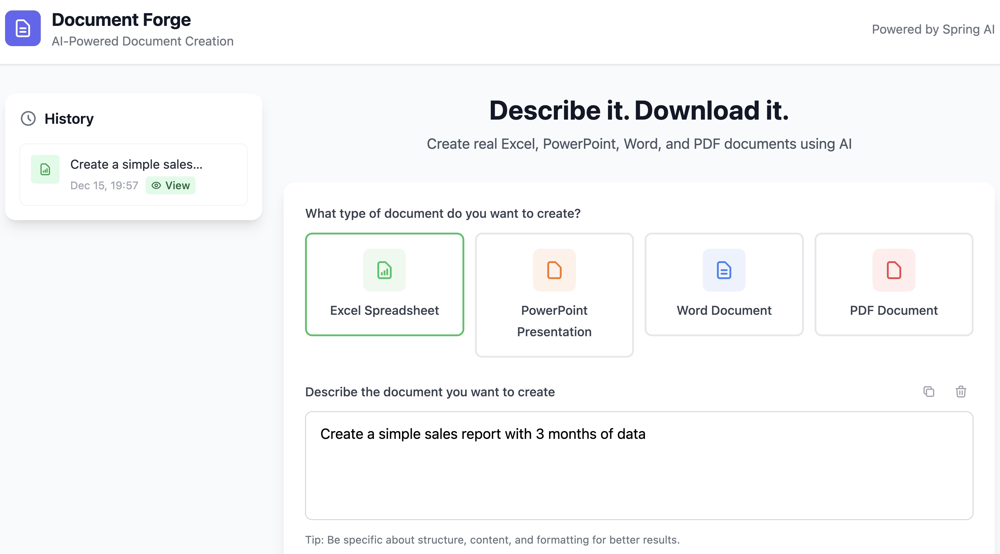
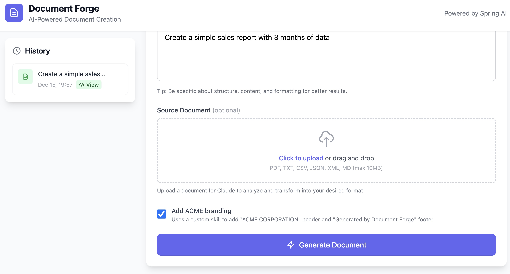
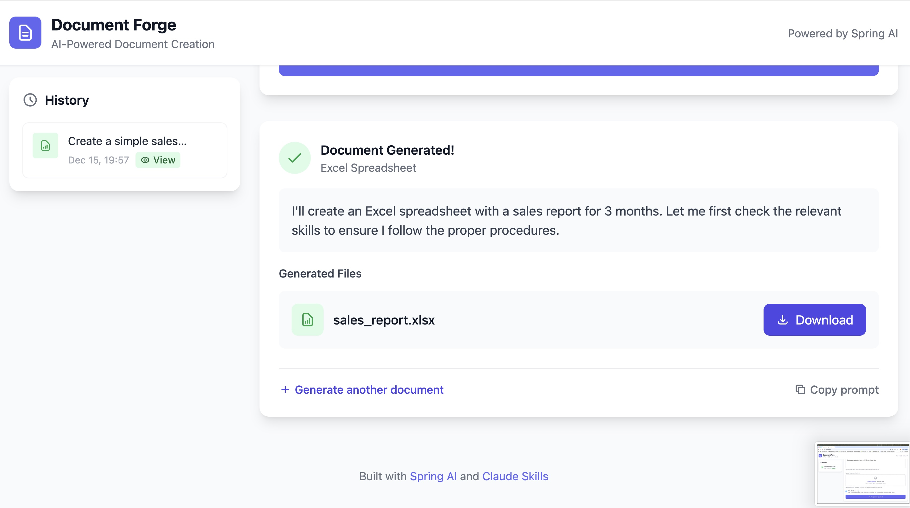

# Document Forge

**AI-Powered Document Creation Studio built with Spring AI**

*"Describe it. Download it."*

## Overview

Document Forge is a demo application showcasing [Claude Skills](https://platform.claude.com/docs/en/agents-and-tools/agent-skills/overview) integration with [Spring AI](https://docs.spring.io/spring-ai/reference/2.0-SNAPSHOT/api/chat/anthropic-chat.html#_skills).
Describe documents in natural language and receive real, downloadable files generated by Claude.

### Supported Document Types

| Type | Extension | Description |
|------|-----------|-------------|
| Excel | `.xlsx` | Spreadsheets with data, formulas, and formatting |
| PowerPoint | `.pptx` | Presentations with slides and layouts |
| Word | `.docx` | Documents with formatting and structure |
| PDF | `.pdf` | Portable document format |

## Screenshots


*Select document type and describe what you want*


*Claude generates your document using Skills*


*Download your generated document*

## Quick Start

### Prerequisites

- Java 21+
- Maven 3.9+
- Anthropic API Key

### Run

```bash
export ANTHROPIC_API_KEY=your-api-key-here
./mvnw spring-boot:run
```

Open http://localhost:8080

## Features

- **Natural Language Input** - Describe what you want in plain English
- **Real File Generation** - Get actual downloadable files, not just descriptions
- **Source Document Upload** - Upload PDF, TXT, CSV, JSON, XML, or MD files for Claude to transform
- **Custom Skills Support** - Apply custom branding or formatting via Anthropic custom skills
- **History Sidebar** - View past generations and re-download files
- **Async Generation** - PowerPoint presentations run in the background with completion notifications

## Custom Skills Integration

Document Forge demonstrates combining pre-built Anthropic skills with custom skills.
An example custom skill is included in `custom-skills/watermark/SKILL.md`.

### Setting Up the Custom Skill

1. **Upload the skill to Anthropic:**

```bash
cd custom-skills/watermark

curl -X POST "https://api.anthropic.com/v1/skills" \
  -H "x-api-key: $ANTHROPIC_API_KEY" \
  -H "anthropic-version: 2023-06-01" \
  -H "anthropic-beta: skills-2025-10-02" \
  -F "display_title=Document Watermark" \
  -F "files[]=@SKILL.md;filename=document-watermark/SKILL.md"
```

2. **Copy the skill ID from the response** (e.g., `skill_01AbCdEfGhIjKlMnOpQrStUv`)

3. **Set the environment variable:**

```bash
export CUSTOM_SKILL_ID=skill_01AbCdEfGhIjKlMnOpQrStUv
```

4. **Run the application** - The "Apply custom branding" checkbox will now appear in the UI

### Without Custom Skills

If `CUSTOM_SKILL_ID` is not set, the application works normally with pre-built skills only.
The custom branding checkbox will not be shown.

See the [Spring AI Custom Skills documentation](https://docs.spring.io/spring-ai/reference/2.0-SNAPSHOT/api/chat/anthropic-chat.html#_custom_skills) for more details.

## Usage Examples

**Excel - Sales Report**
> "Create a sales report for Q4 2024 with monthly revenue, expenses, and profit columns."

**PowerPoint - Pitch Deck**
> "Create a 5-slide presentation for a startup called 'GreenTech' that makes sustainable packaging."

**Word - Cover Letter**
> "Write a professional cover letter for a software engineering position. The candidate has 5 years of experience with Java and Spring Boot."

**PDF - Invoice**
> "Create an invoice for 40 hours of consulting at $150/hour with standard payment terms."

**Transform a Document**

Upload a meeting notes text file and prompt:
> "Create an action items tracker spreadsheet with columns for task, owner, due date, and status."

## Tech Stack

| Layer | Technology |
|-------|------------|
| Backend | Spring Boot 4.0 |
| AI | Spring AI 2.0.0-SNAPSHOT + Anthropic Claude Skills |
| Templates | Thymeleaf |
| Interactivity | HTMX |
| Styling | Tailwind CSS |

## Configuration

```yaml
spring:
  ai:
    anthropic:
      api-key: ${ANTHROPIC_API_KEY}
      chat:
        options:
          model: claude-sonnet-4-5-20250514
```

## How It Works

```
User Prompt → Spring AI → Claude Skills → File Generated → Download
```

1. User selects document type and enters a natural language prompt
2. Spring AI sends the request to Claude with the appropriate skill enabled
3. Optionally, a custom skill is added for branding or formatting
4. Claude generates the actual document file using code execution
5. `AnthropicSkillsResponseHelper` extracts file IDs from the response
6. Files are downloaded via Anthropic's Files API and served to the user

---

Built with Spring AI.
