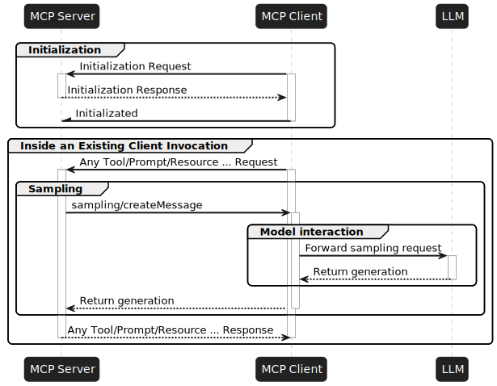

# Spring AI MCP Sampling Examples

This directory contains examples demonstrating the Model Context Protocol (MCP) Sampling capability in Spring AI. MCP Sampling allows an MCP server to delegate certain requests to LLM providers, enabling multi-model interactions and creative content generation.

## Overview

The MCP Sampling examples showcase:

- How an MCP server can delegate LLM requests to a client
- How a client can route requests to different LLM providers based on model hints
- Integration with multiple LLM providers (OpenAI and Anthropic)
- Creative content generation using multiple models
- Combining responses from different LLMs into a unified result

## Projects

This directory contains several projects demonstrating MCP Sampling:

### Main Projects
1. **[mcp-sampling-server](./mcp-sampling-server)**: An MCP server that provides weather information and uses MCP Sampling to generate creative content
2. **[mcp-sampling-client](./mcp-sampling-client)**: An MCP client that handles sampling requests and routes them to different LLM providers

### Annotation-based Examples

Showcase the same MCP Sampling functionality as the main sampling examples but use the annotation-based approach for simplified development - find more in the **[README](./annotations/README.md)**

3. **[annotations/mcp-sampling-server-annotations](./annotations/mcp-sampling-server-annotations)**: Server implementation using Spring AI's annotation-based approach
4. **[annotations/mcp-sampling-client-annotations](./annotations/mcp-sampling-client-annotations)**: Client implementation using Spring AI's annotation-based approach

## What is MCP Sampling?

MCP Sampling is a powerful capability of the Model Context Protocol that allows:

- An MCP server to delegate certain requests to LLM providers
- Specifying model preferences to target specific LLM providers
- Routing requests based on model hints
- Combining responses from multiple LLMs

This approach enables applications to leverage multiple LLM providers within a single workflow, allowing for creative content generation, model comparison, and specialized task delegation.

## How It Works

The MCP Sampling workflow in these examples follows these steps:

1. **Client Initialization**:
   - The client connects to the MCP Weather Server
   - It registers a sampling handler that can route requests to different LLM providers

2. **User Query**:
   - The user sends a weather-related query to the client
   - The client forwards the query to the MCP Weather Server

3. **Server Processing**:
   - The server retrieves weather data from the Open-Meteo API
   - It extracts the `McpSyncServerExchange` from the tool context
   - It creates sampling requests with different model preferences:
     - One targeting OpenAI with `ModelPreferences.builder().addHint("openai").build()`
     - One targeting Anthropic with `ModelPreferences.builder().addHint("anthropic").build()`

4. **Sampling Delegation**:
   - The server sends the sampling requests back to the client
   - The client's sampling handler receives the requests

5. **Model Routing**:
   - The client extracts the model hint from each request
   - It selects the appropriate LLM provider based on the hint
   - It forwards the prompt to the selected LLM

6. **Response Generation**:
   - Each LLM generates a creative response (in this case, a poem about the weather)
   - The client returns the responses to the server

7. **Result Combination**:
   - The server combines the responses from different LLMs
   - It returns the combined result to the user



## Server Implementation

The MCP Weather Server implements the server-side of MCP Sampling:

```java
public String callMcpSampling(ToolContext toolContext, WeatherResponse weatherResponse) {
    StringBuilder openAiWeatherPoem = new StringBuilder();
    StringBuilder anthropicWeatherPoem = new StringBuilder();

    McpToolUtils.getMcpExchange(toolContext)
            .ifPresent(exchange -> {
                if (exchange.getClientCapabilities().sampling() != null) {
                    var messageRequestBuilder = McpSchema.CreateMessageRequest.builder()
                            .systemPrompt("You are a poet!")
                            .messages(List.of(new McpSchema.SamplingMessage(McpSchema.Role.USER,
                                    new McpSchema.TextContent(
                                            "Please write a poem about this weather forecast (temperature is in Celsius). Use markdown format :\n "
                                                    + ModelOptionsUtils.toJsonStringPrettyPrinter(weatherResponse)))));

                    // Request poem from OpenAI
                    var openAiLlmMessageRequest = messageRequestBuilder
                            .modelPreferences(ModelPreferences.builder().addHint("openai").build())
                            .build();
                    CreateMessageResult openAiLlmResponse = exchange.createMessage(openAiLlmMessageRequest);
                    openAiWeatherPoem.append(((McpSchema.TextContent) openAiLlmResponse.content()).text());

                    // Request poem from Anthropic
                    var anthropicLlmMessageRequest = messageRequestBuilder
                            .modelPreferences(ModelPreferences.builder().addHint("anthropic").build())
                            .build();
                    CreateMessageResult anthropicAiLlmResponse = exchange.createMessage(anthropicLlmMessageRequest);
                    anthropicWeatherPoem.append(((McpSchema.TextContent) anthropicAiLlmResponse.content()).text());
                }
            });

    // Combine responses
    return "OpenAI poem about the weather: " + openAiWeatherPoem.toString() + "\n\n" +
           "Anthropic poem about the weather: " + anthropicWeatherPoem.toString() + "\n" +
           ModelOptionsUtils.toJsonStringPrettyPrinter(weatherResponse);
}
```

## Client Implementation

The MCP Sampling Client implements the client-side handling of sampling requests:

```java
@Bean
McpSyncClientCustomizer samplingCustomizer(Map<String, ChatClient> chatClients) {
    return (name, spec) -> {
        spec.sampling(llmRequest -> {
            var userPrompt = ((McpSchema.TextContent) llmRequest.messages().get(0).content()).text();
            String modelHint = llmRequest.modelPreferences().hints().get(0).name();

            // Find the appropriate chat client based on the model hint
            ChatClient hintedChatClient = chatClients.entrySet().stream()
                    .filter(e -> e.getKey().contains(modelHint)).findFirst()
                    .orElseThrow().getValue();

            // Generate response using the selected model
            String response = hintedChatClient.prompt()
                    .system(llmRequest.systemPrompt())
                    .user(userPrompt)
                    .call()
                    .content();

            return CreateMessageResult.builder().content(new McpSchema.TextContent(response)).build();
        });
    };
}
```

NOTE: To prevent cyclic dependencies you have to disable MCP tool callbacks auto-configuration: `spring.ai.mcp.client.toolcallback.enabled=false`

## Running the Examples

### Prerequisites

- Java 17 or later
- Maven 3.6+
- OpenAI API key
- Anthropic API key

### Step 1: Start the MCP Weather Server

```bash
cd mcp-sampling-server
./mvnw clean package -DskipTests
java -jar target/mcp-sampling-server-0.0.1-SNAPSHOT.jar
```

### Step 2: Set Environment Variables

```bash
export OPENAI_API_KEY=your-openai-key
export ANTHROPIC_API_KEY=your-anthropic-key
```

### Step 3: Run the MCP Sampling Client

```bash
cd mcp-sampling-client
./mvnw clean package
java -Dai.user.input='What is the weather in Amsterdam right now?' -jar target/mcp-sampling-client-0.0.1-SNAPSHOT.jar
```

## Sample Output

When you run the application, you'll see creative responses from both OpenAI and Anthropic models, each generating a poem about the current weather in Amsterdam.

## Related Projects

Spring AI provides several MCP client and server implementations:

- **[MCP Annotations](../mcp-annotations)**: Examples using Spring AI's annotation-based MCP approach
- **[Weather Server](../weather)**: A simple weather MCP server example
- **[SQLite Server](../sqlite)**: An MCP server that provides SQLite database access
- **[Filesystem Server](../filesystem)**: An MCP server for file system operations

## Additional Resources

* [Spring AI Documentation](https://docs.spring.io/spring-ai/reference/)
* [MCP Server Boot Starter](https://docs.spring.io/spring-ai/reference/api/mcp/mcp-server-boot-starter-docs.html)
* [MCP Client Boot Starter](https://docs.spring.io/spring-ai/reference/api/mcp/mcp-client-boot-starter-docs.html)
* [Model Context Protocol Specification](https://modelcontextprotocol.github.io/specification/)
* [Spring Boot Documentation](https://docs.spring.io/spring-boot/docs/current/reference/html/)
