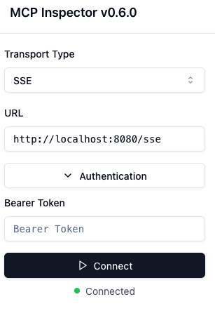

# MCP with OAuth

This sample demonstrates how to secure an MCP server using OAuth2, as per
the [MCP specification](https://spec.modelcontextprotocol.io/specification/2025-03-26/basic/authorization/).

## Getting started

Run the project with:

```
./mvnw spring-boot:run
```

Obtain a token by calling the `/oauth2/token` endpoint:

```shell
curl -XPOST "http://localhost:8080/oauth2/token" \
  --data grant_type=client_credentials \
  --user "mcp-client:secret"
# And copy-paste the access token
# Or use JQ:
curl -XPOST "http://localhost:8080/oauth2/token" \
  --data grant_type=client_credentials \
  --user "mcp-client:secret" | jq -r ".access_token"
```

Store that token, and then boot up the MCP inspector:

```shell
npx @modelcontextprotocol/inspector@0.6.0
```

In the MCP inspector, paste your token. Click connect, and voilà!



Note that the token is only valid for 5 minutes

## Implementation considerations

### Dependencies

In Spring, OAuth2 Support for MCP server means adding:

1. [Spring Security](https://docs.spring.io/spring-security/) (infrastructure for security)
2. [Spring Authorization Server](https://docs.spring.io/spring-authorization-server/) (issuing tokens)
3. [Spring Security: OAuth2 Resource Server](https://docs.spring.io/spring-security/reference/servlet/oauth2/resource-server/index.html#page-title) (
   authentication using tokens)

Note that Spring Auth Server does not support the reactive stack, so issuing tokens only works in Servlet.
