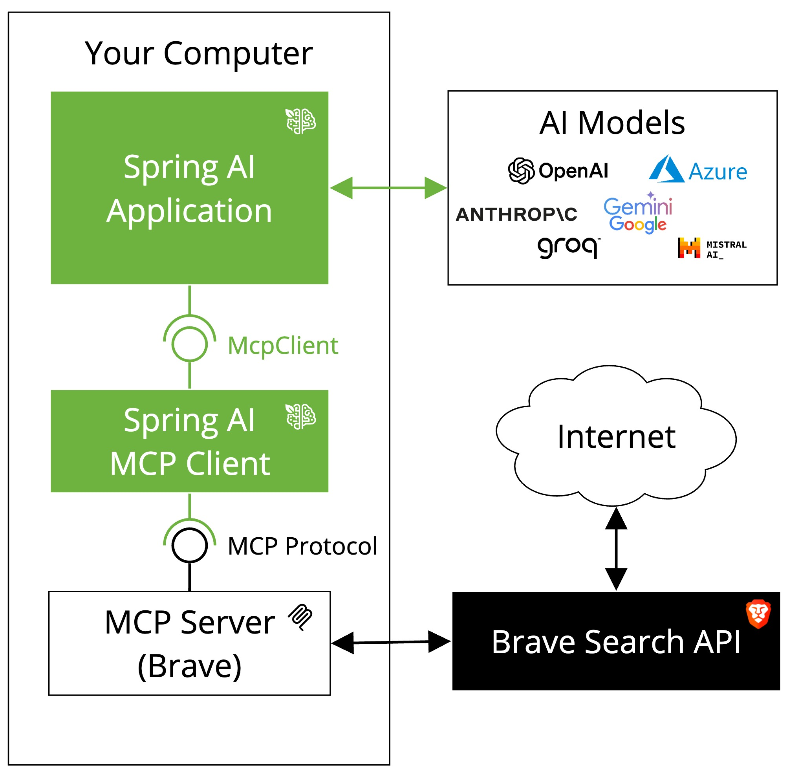

# Spring AI - Model Context Protocol (MCP) Brave Search Example

This example demonstrates how to use the Spring AI Model Context Protocol (MCP) with the [Brave Search MCP Server](https://github.com/modelcontextprotocol/servers/tree/main/src/brave-search) using Spring Boot's auto-configuration capabilities. The application enables natural language interactions with Brave Search, allowing you to perform internet searches through a conversational interface. When run, the application demonstrates the MCP client's capabilities by asking a specific question: "Does Spring AI supports the Model Context Protocol? Please provide some references." The MCP client uses Brave Search to find relevant information and returns a comprehensive answer. After providing the response, the application exits.

Unlike the manual configuration approach, this example uses the Spring Boot starter which automatically creates the MCP client for you, moving the configuration into `application.properties` and `mcp-servers-config.json`.

## Dependencies

The project uses the following key dependencies:

```xml
<dependency>
    <groupId>org.springframework.ai</groupId>
    <artifactId>spring-ai-starter-mcp-client</artifactId>
</dependency>

<dependency>
    <groupId>org.springframework.ai</groupId>
    <artifactId>spring-ai-starter-model-anthropic</artifactId>
</dependency>
```



## Prerequisites

- Java 17 or higher
- Maven 3.6+
- npx package manager
- Anthropic API key
- Brave Search API key (Get one at https://brave.com/search/api/)

## Setup

1. Install npx (Node Package eXecute):
   First, make sure to install [npm](https://docs.npmjs.com/downloading-and-installing-node-js-and-npm)
   and then run:
   ```bash
   npm install -g npx
   ```

2. Clone the repository:
   ```bash
   git clone https://github.com/spring-projects/spring-ai-examples.git
   cd model-context-protocol/brave-starter
   ```

3. Set up your API keys:
   ```bash
   export ANTHROPIC_API_KEY='your-anthropic-api-key-here'
   export BRAVE_API_KEY='your-brave-api-key-here'
   ```

4. Build the application:
   ```bash
   ./mvnw clean install
   ```

## Running the Application

Run the application using Maven:
```bash
./mvnw spring-boot:run
```

The application will demonstrate the integration by asking a sample question about Spring AI and Model Context Protocol, utilizing Brave Search to gather information.

## How it Works

The application uses Spring Boot's auto-configuration capabilities to set up the MCP client. The configuration is primarily done through two files:

### Project Dependencies

The project uses Spring AI's MCP client Spring Boot starter and Anthropic starter:

```xml
<dependency>
    <groupId>org.springframework.ai</groupId>
    <artifactId>spring-ai-starter-mcp-client</artifactId>
</dependency>

<dependency>
    <groupId>org.springframework.ai</groupId>
    <artifactId>spring-ai-starter-model-anthropic</artifactId>
</dependency>
```

### Configuration Files

The MCP client can be configured in two different ways, both achieving the same behavior:

#### Option 1: Direct Configuration in application.properties

This approach configures the MCP client directly in the application.properties file:

```properties
spring.application.name=mcp
spring.main.web-application-type=none
spring.ai.anthropic.api-key=${ANTHROPIC_API_KEY}

# Direct MCP client configuration
spring.ai.mcp.client.stdio.connections.brave-search.command=npx
spring.ai.mcp.client.stdio.connections.brave-search.args=-y,@modelcontextprotocol/server-brave-search
```

#### Option 2: External Configuration File

Alternatively, you can move the MCP configuration to an external file. This approach is similar to how the anthropic standalone client is configured.

1. In `application.properties`, enable the external configuration and comment out the direct configuration:
```properties
spring.application.name=mcp
spring.main.web-application-type=none
spring.ai.anthropic.api-key=${ANTHROPIC_API_KEY}

# Use external configuration file
spring.ai.mcp.client.stdio.servers-configuration=classpath:/mcp-servers-config.json

# Comment out direct configuration when using external file
# spring.ai.mcp.client.stdio.connections.brave-search.command=npx
# spring.ai.mcp.client.stdio.connections.brave-search.args=-y,@modelcontextprotocol/server-brave-search
```

2. In `mcp-servers-config.json` - Define the MCP server configuration:
```json
{
  "mcpServers": {
    "brave-search": {
      "command": "npx",
      "args": [
        "-y",
        "@modelcontextprotocol/server-brave-search"
      ],
      "env": {}
    }
  }
}
```

### Application Code

The main application (`Application.java`) uses the auto-configured components to create a chat client and execute a single question:

```java
@SpringBootApplication
public class Application {
    @Bean
    public CommandLineRunner predefinedQuestions(ChatClient.Builder chatClientBuilder, 
            List<ToolCallback> tools, ConfigurableApplicationContext context) {
        return args -> {
            var chatClient = chatClientBuilder
                    .defaultToolCallbacks(tools)
                    .build();

            String question = "Does Spring AI support the Model Context Protocol? Please provide some references.";
            System.out.println("QUESTION: " + question);
            System.out.println("ASSISTANT: " + chatClient.prompt(question).call().content());

            context.close();
        };
    }
}
```

The application uses Spring Boot's auto-configuration to automatically create and configure the MCP client based on the properties and configuration files, without requiring explicit bean definitions for the client itself.


# MCP Configuration
spring.ai.mcp.client.stdio.enabled=true
spring.ai.mcp.client.stdio.servers-configuration=classpath:/mcp-servers-config.json
```

2. `mcp-servers-config.json` - MCP server configuration:
```json
{
  "mcpServers": {
    "brave-search": {
      "command": "npx",
      "args": [
        "-y",
        "@modelcontextprotocol/server-brave-search"
      ],
      "env": {
      }
    }
  }
}
```

### Auto-Configuration

Spring Boot's auto-configuration handles the setup:
- Configures the application as a command-line tool (non-web)
- Sets up the Anthropic integration using the provided API key
- Enables the MCP STDIO client for communication with the Brave Search server
- Provides a `List<ToolCallback>` bean containing the Brave Search capabilities, which is automatically injected into the `CommandLineRunner`

### Main Application

The `Application.java` file demonstrates a simple Spring Boot application that:

1. Uses Spring Boot's `CommandLineRunner` to execute a predefined question when the application starts
2. Creates a `ChatClient` with the automatically configured MCP tools (Brave Search capabilities)
3. Asks a specific question about Spring AI and Model Context Protocol
4. Prints both the question and the AI assistant's response to the console
5. Automatically closes the application after receiving the response

Here's the key code from `Application.java`:

```java
@Bean
public CommandLineRunner predefinedQuestions(ChatClient.Builder chatClientBuilder, 
        List<ToolCallback> tools, ConfigurableApplicationContext context) {
    return args -> {
        var chatClient = chatClientBuilder
                .defaultToolCallbacks(tools)
                .build();

        String question = "Does Spring AI support the Model Context Protocol? "
                + "Please provide some references.";

        System.out.println("QUESTION: " + question);
        System.out.println("ASSISTANT: " + chatClient.prompt(question).call().content());

        context.close();
    };
}
```

The application automatically:
- Injects the `ChatClient.Builder` and `ToolCallback` list (containing Brave Search capabilities)
- Configures the chat client with the available tools
- Executes a predefined question
- Uses Brave Search when needed to gather information for the response

This setup allows the AI model to do the following:
- Understand when to use Brave Search
- Format queries appropriately
- Process and incorporate search results into responses
