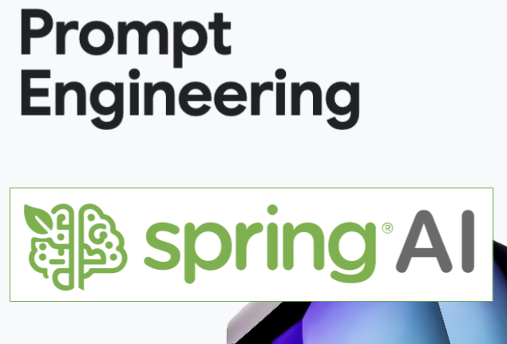

# Prompt Engineering with Spring AI

## Overview

This repository contains practical implementations of Prompt Engineering techniques using [Spring AI](https://docs.spring.io/spring-ai/reference/index.html). These examples accompany the blog post: [Spring AI Prompt Engineering Patterns](https://spring.io/blog/2025/04/14/spring-ai-prompt-engineering-patterns).

The examples and patterns are based on the comprehensive [Prompt Engineering Guide](https://www.kaggle.com/whitepaper-prompt-engineering) that covers the theory, principles, and patterns of effective prompt engineering. 

Here we shows how to translate those concepts into working Java code using Spring AI's fluent [ChatClient API](https://docs.spring.io/spring-ai/reference/api/chatclient.html). 

#### Structure

The examples follow the same structure and patterns outlined in the original Goolge Prompt Egineering guide, making it easy to reference between theory and implementation.

## Resources

- [Spring AI Documentation](https://docs.spring.io/spring-ai/reference/index.html)
- [ChatClient API Reference](https://docs.spring.io/spring-ai/reference/api/chatclient.html)
- [Google's Prompt Engineering Guide](https://www.kaggle.com/whitepaper-prompt-engineering)
- [Spring AI Prompt Engineering Patterns  Blog](https://spring.io/blog/2025/04/14/spring-ai-prompt-engineering-patterns)
